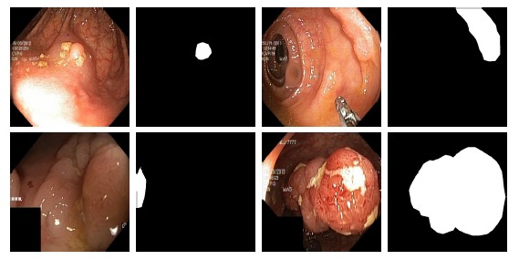
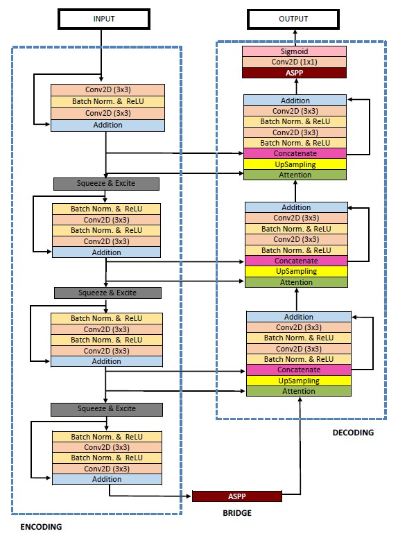
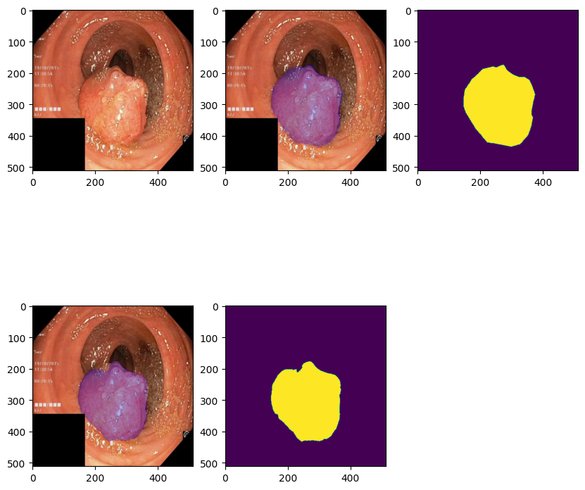
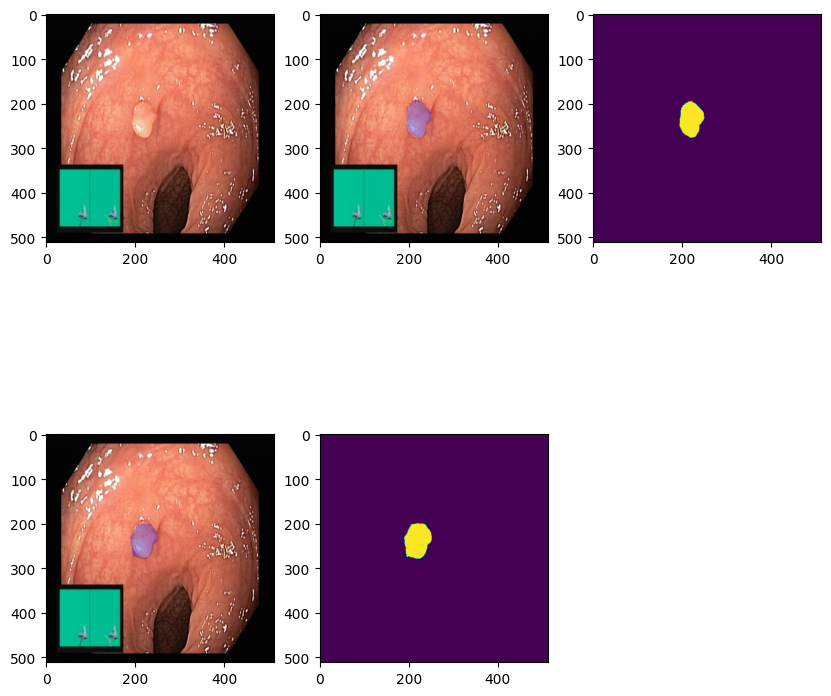

# PyTorch Implementation of ResUnet++✨

## Abstract
Accurate computer-aided polyp detection and segmentation during colonoscopy examinations can help endoscopists resect abnormal tissue and thereby decrease chances of polyps growing into cancer. Towards developing a fully automated model for pixel-wise polyp segmentation, we propose ResUNet++, which is an improved ResUNet architecture for colonoscopic image segmentation. Our experimental evaluations show that the suggested architecture produces good segmentation results on publicly available datasets. Furthermore, ResUNet++ significantly outperforms U-Net and ResUNet, two key state-ofthe-art deep learning architectures, by achieving high evaluation scores with a dice coefficient of 81.33%, and a mean Intersection over Union (mIoU) of 79.27% for the Kvasir-SEG dataset and a dice coefficient of 79.55%, and a mIoU of 79.62% with CVC-612 dataset.
<p align="center">
  
</p>

## Model Architecture
<p align="center">
  
</p>

ResUnet++ architecture is based on the Deep Residual U-Net, which is an architecture that uses the strength of deep residual learning and U-Net. The Proposed ResUnet++ architecture take advantage of the residual blocks, the squeeze and excitation block, ASPP and the attention block.

## Model Short Explanation
* Residual Units  
Training a deep neural network with an increasing depth can improve accuracy. However, it can hamper training process and cause degradation problem. To address this problem, ResUnet uses full pre-activation residual units that helps to propagate information using skip connections, improving the design of the neural network.

* Squeeze and Excitation Units (SE)  
Squeeze and Excitation network boosts the representative power of the network by re-calibrating the features responses employing precise modeling inter-dependencies between the channels. The goal of the squeeze and excite block is to ensure that the network can increase its sensitivy to the relevant features and suppress the unnecessary features.

* Astrous Spatial Pyramid Pooling (ASPP)  
In ASPP, the contextual information is captured at various scales, and many parallel astrous convolutions with different rates in the input feature map are fused. In the proposed architecutre, ASPP acts acts a bridge between encoder and decoder.

* Attention Units  
The attention mechanism is mostly popular in NLP task. It gives attention to the subset of its input. The attention mechanism determines which parts of the network require more attention in the neural network. The main advantage of the attention mechanism is that they are simple, can be applied to any input size, enhance the quality of features that boosts the results.

## Blocks Configurations 
| Block | Configuration |
| ------ | ------ |
| Conv2D Encoder | Kernel=3; Stride=2,1; Padding=1; Bias=False |
| Conv2D Decoder | Kernel=3; Stride=1, Padding=1; Bias=False |
| Conv2D Output | Kernel=1; Stride=1, Padding=0; Bias=False |
| Skip Connection | Kernel=1; Stride=1, Padding=0; Bias=False |
| Squeeze & Excite | Ratio=8 |
| ASPP | Kernel=3; Stride=1; Padding=0,6,12,18; Dilation=1,6,12,18; Bias=False |
| Attention | Non Local Block Self-Attention |
| Upsampling | Interpolate Bilinear |

## Evaluations
All models had been trained with the same configurations and tested with 100 datasets.
* Epochs: 120
* Learning Rate: 1e-4
* Weight Decay: 1e-2
* Loss: Focal Dice
* Optimizer: AdamW
* Data Augmentations:
    * CropNonEmptyMaskIfExist
    * VerticalFlip
    * HorizontalFlip
    * Sharpen
    * ElasticTransformation
      
| Model | Dice | mIoU | Recall | Precision
| ----- | ---- | ---- | ------ | -------- |
| ResUnet++ (Thesis) | 0.8133 | 0.7927 | 0.7064 | 0.8774 |
| Unet (Thesis) | 0.7147 | 0.4334 | 0.6306 | 0.9222 |
| ResUnet++  | 0.8445 | 0.7312 | 0.8211 | 0.8755 |
| DeepLabV3+ | 0.8010 | 0.6687 | 0.7683 | 0.8458 |
| UNet | 0.8584 | 0.7533 | 0.8246 | 0.8993 |

Result 1             |  Result 2
:-------------------------:|:-------------------------:
  |  

## Environments
These are the environments used to test the model:
* Python 3.8
* PyTorch 2.0
* V100 32GB

## Model Script File
<details>
  <summary>Pre-configured parameters:</summary>  
  
  | Name | Parameters |
  | ---- | -------- |
  | In Channels | 3 |
  | Encoders Out Channels | 16,32,64,128 |
  | Class Channels | 29 |
  | Squeeze Exitation Ratio | 8 |
  | Attention Ratio | 8 |
  | Dilation Rates | 1,6,12,18 |
  | Bias | False |

  To use default parameters:  
  Change the number of class channels to your specific task!
  ```
  model = ResUnetPP(class_channel=29)
  ```

  - [x] [resunet++(default)](model/resunet++.py)
</details>

<details>
  <summary>User-defined parameters:</summary>

  To use user-defined parameters, you need to insert information from the list below:
  * In Channels
  * Encoders Out Channels
  * Class Channels
  * Squeeze Exitation Ratio
  * Attention Ratio
  * Dilation Rates
  * Bias
  ```
  model = ResUnetPP(in_channels: int, encoder_out_channels: List[int], class_channels: int, se_ratio: int, attention_ratio: int, dilation: List[int], bias: bool)
  ```
  - [x] [resunet++(user)](model/resunet++_user.py)
</details>

---
More detailed information about ResUnet++ can be seen using the link down below:  
[https://arxiv.org/abs/1911.07067](https://arxiv.org/abs/1911.07067)
